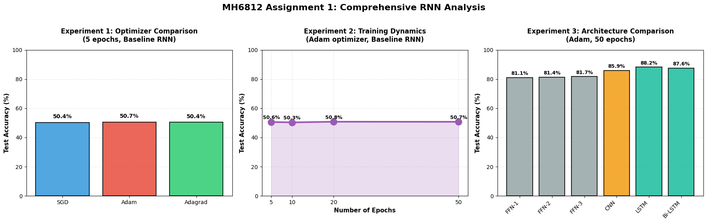

# RNN Sentiment Classification on IMDb

[](https://www.python.org/)
[](https://pytorch.org/)

A controlled comparison of optimisers, training length and six neural architectures for binary
sentiment classification of IMDb movie reviews, implemented in PyTorch.

*Coursework for MH6812, Nanyang Technological University.*

## Questions

1. **Optimisers.** Does SGD, Adam or Adagrad matter for a vanilla RNN trained for 5 epochs?
2. **Training length.** Does training the vanilla RNN for longer (5 to 50 epochs) help?
3. **Architectures.** How do feed-forward networks, a CNN, an LSTM and a Bi-LSTM compare?

## Repository contents

```
rnn-sentiment-classification-on-imdb/
├── rnn_sentiment_classification.ipynb   # All experiments, with outputs from the original run
├── experiment_results.png               # Figure produced by the notebook
└── README.md
```

Running the notebook also writes `summary_optimizer.csv`, `summary_epochs.csv` and
`summary_models.csv`.

## Setup

| Setting | Value |
|---|---|
| Data | IMDb, 25,000 training and 25,000 test reviews (Keras pre-tokenised version) |
| Train / validation split | 70 / 30 of the training set (17,500 / 7,500) |
| Vocabulary | 10,000 most frequent tokens |
| Sequence length | 500 tokens; shorter reviews padded at the end, longer ones truncated |
| Embeddings | 128 dimensions, randomly initialised and trained jointly |
| Hidden size | 256 |
| Batch size | 32 |
| Dropout | 0.3 |
| Loss | Binary cross-entropy on a sigmoid output |
| Gradient clipping | max norm 1.0 |
| Learning rate | 0.001 for all optimisers |

### Architectures

| Model | Structure | Parameters |
|---|---|---:|
| Baseline RNN | Embedding → vanilla RNN → linear, using the final hidden state | 1,379,073 |
| FFN-1 | Flattened embeddings (500 × 128) → 256 → 1 | 17,664,513 |
| FFN-2 | Flattened embeddings → 256 → 128 → 1 | 17,697,281 |
| FFN-3 | Flattened embeddings → 256 → 128 → 64 → 1 | 17,705,473 |
| CNN | Parallel 1-D convolutions (kernel sizes 1, 2, 3; 100 filters each) → global max-pooling → linear | 1,357,401 |
| LSTM | Embedding → LSTM → linear, using the final hidden state | 1,675,521 |
| Bi-LSTM | Embedding → bidirectional LSTM → concatenated final states → linear | 2,071,041 |

## Results

All figures are test-set results after the final epoch, from a single run on a Google Colab GPU.



### Warm-up and Experiment 1: optimisers (vanilla RNN, 5 epochs)

| Optimiser | Test loss | Test accuracy |
|---|---:|---:|
| SGD (warm-up run) | 0.6934 | 49.70% |
| SGD | 0.6934 | 50.36% |
| Adam | 0.6938 | 50.65% |
| Adagrad | 0.6932 | 50.42% |

### Experiment 2: training length (vanilla RNN, Adam)

| Epochs | Test loss | Test accuracy |
|---:|---:|---:|
| 5 | 0.6955 | 50.62% |
| 10 | 0.6962 | 50.34% |
| 20 | 0.7148 | 50.80% |
| 50 | 0.7607 | 50.74% |

### Experiment 3: architectures (Adam, 50 epochs)

| Model | Parameters | Test loss | Test accuracy |
|---|---:|---:|---:|
| FFN-1 | 17,664,513 | 2.1329 | 81.06% |
| FFN-2 | 17,697,281 | 3.0262 | 81.40% |
| FFN-3 | 17,705,473 | 2.3577 | 81.75% |
| CNN | 1,357,401 | 2.7550 | 85.94% |
| **LSTM** | **1,675,521** | **0.6804** | **88.17%** |
| Bi-LSTM | 2,071,041 | 0.8533 | 87.60% |

## Findings

1. **The vanilla RNN does not learn the task.** Whatever the optimiser or training length, its
   test accuracy stays between 49.7% and 50.8%, which is chance level. The gaps between optimisers
   are a few tenths of a percentage point and are within run-to-run noise. Longer training only
   raises the test loss (0.6955 at 5 epochs, 0.7607 at 50).
2. **Architecture is the dominant factor.** Switching from the vanilla RNN to an LSTM raises test
   accuracy by about 37 percentage points, to 88.17%. The Bi-LSTM (87.60%) and CNN (85.94%) follow.
3. **Inductive bias matters more than parameter count.** The feed-forward networks have more than
   17.6M parameters each but reach only 81.1–81.8%, because flattening the embeddings discards word
   order. The CNN reaches 85.94% with 1.36M parameters. Per percentage point of accuracy, the CNN
   (~15.8k parameters) and LSTM (~19.0k) are more than ten times as efficient as the FFNs (~217k).
4. **High test loss signals over-confidence.** With no early stopping, the FFNs and CNN end with
   test losses of 2.1–3.0 despite 81–86% accuracy: their mistakes are made with high confidence.

## Limitations

- **Padding position.** Reviews are padded after the text, and the recurrent models classify from
  the final hidden state. For most reviews this means the last hundreds of steps are padding. Along
  with vanishing gradients, this is a likely reason the vanilla RNN stays at chance. Padding before
  the text, or `nn.utils.rnn.pack_padded_sequence`, would remove the effect; this has not been re-run.
- **No model selection.** Validation loss is computed each epoch but is not used for early stopping.
- **Single run.** Each configuration was trained once, so small differences should not be read as
  real effects.
- **Embeddings.** All embeddings are trained from scratch; pre-trained vectors such as GloVe were
  not tested.

## Running the notebook

Open `rnn_sentiment_classification.ipynb` in Google Colab with a GPU runtime and run all cells.
Experiment 3 trains six models for 50 epochs each and takes the longest. Locally:

```bash
pip install torch tensorflow numpy pandas matplotlib
jupyter notebook rnn_sentiment_classification.ipynb
```

TensorFlow is needed only to download the IMDb data and pad sequences; all models use PyTorch.
NumPy and PyTorch seeds are fixed, but GPU kernels are not forced to be deterministic, so a re-run
can differ slightly from the reported numbers.
